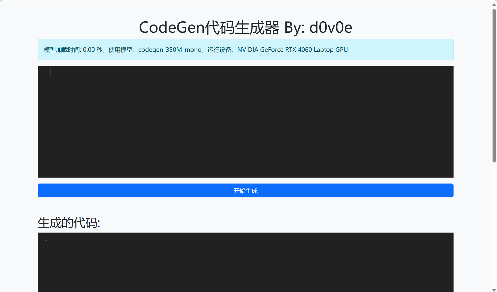

### Environment Setup 
1. Download Python 3.10 from [here](https://www.python.org/downloads/) and install it. Or you can install it using wget and compile it yourself.
```bash
# download the python 3.10 source code
wget https://www.python.org/ftp/python/3.10.11/Python-3.10.11.tar.xz
tar -xf Python-3.10.11.tar.xz
cd Python-3.10.11
# set the installation path
./configure --enable-optimizations  --prefix=/usr/local/python3.10
# compile and install
make -j8
sudo make altinstall
# set up the symbolic links for python3.10 and pip3.10
sudo ln -s -b /usr/local/python3.10/bin/python3.10 /usr/bin/python3.10
sudo ln -s -b /usr/local/python3.10/bin/pip3.10 /usr/bin/pip3.10
```
2. Create the virtual environment with python 3.10 using venv.
```bash
# Download the CodeGenFlask source code
cd ~
git clone https://github.com/d0v0e/CodeGenFlask.git
# Create a virtual environment with python 3.10
cd CodeGenFlask
mkdir ./env && cd ./env
python3.10 -m venv ./env/py3-10_env
```
3. Activate the env, install and test the requirements using `set_up.sh`.
```bash
cd ~/CodeGenFlask
./set_up.sh
```
The expected output is that:


4. Run the CodeGenFlask server using `start.sh`.
```bash
cd ~/CodeGenFlask
./start.sh
```
Follow the link: http://localhost:5000/, the expected output is that:

