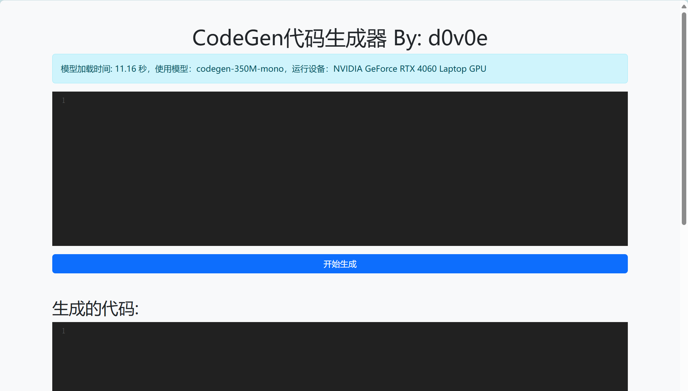
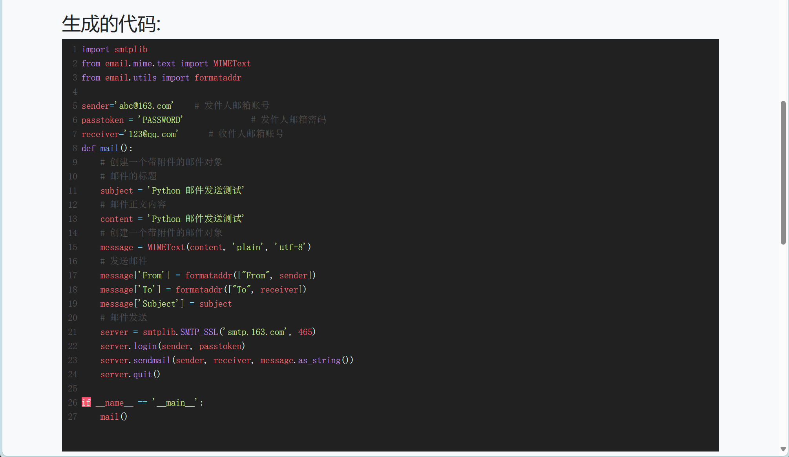

## Introduction
CodeGen大语言模型是由Salesforce开发的一款强大的自动化代码生成工具。它旨在通过将元数据转化为可读、可维护的源代码，帮助开发者高效地构建和管理基于Apex（Salesforce的定制编程语言）的应用程序，原项目：[CodeGen](https://github.com/salesforce/CodeGen)

本项目是基于CodeGen大语言模型的一个Flask版本，使用Python简易开发提供可视化web服务。相较原项目提供了可视化平台和更加详细的教程。

---

CodeGen Large Language Model is a powerful automated code generation tool developed by Salesforce. It is designed to help developers efficiently build and manage applications based on Apex (Salesforce's customized programming language) by transforming metadata into readable, maintainable source code, Original project: [CodeGen](https://github.com/salesforce/CodeGen)

This project is based on CodeGen large language model of a Flask version, using Python simple development to provide visualization web services. Compared with the original project, it provides a visualization platform and more detailed tutorials.

## Model Architecture
CodeGen使用自回归形式的transformer在自然语言和编程语言数据集上进行训练。模型尺寸包括：350M、2.7B、6.1B和16.1B。

CodeGen模型族会在三个数据集上顺序训练：THEPILE、BIGQUERY和BIGPYTHON。

THEPILE是一个用于语言建模的825.18GB英文数据集。该数据集是基于22个高质量子集构造的，其中一个是从GitHub上收集的编程语言数据，占整个数据集的7.6%。基于该数据集训练的模型称为自然语言CodeGen模型(CodeGen-NL)。

多语言数据集BIGQUERY是Google公开数据集BigQuery的子集，其是由多种编程语言构成的。选择6种编程语言C、C++、Go、Java、JavaScript和Python进行多语言训练。称在BIGQUERY上训练的模型为多语言CodeGen模型(CodeGen-Multi)。

单语言数据集BIGPYTHON包含了大量python的数据。该数据集中包含了至2021年10月的公开、可获取且非个人的python代码。称在BIGPYTHON上训练的模型为单语言CodeGen模型(CodeGen-Mono)。

releases部分提供了350M的momo模型供环境测试，其他模型可以在[huggingface官网](https://huggingface.co/models?search=salesforce+codegenl)进行下载。

---

CodeGen is trained on natural language and programming language datasets using an autoregressive form of transformer. Model sizes include: 350M, 2.7B, 6.1B, and 16.1B.

CodeGen model families are trained sequentially on three datasets: THEPILE, BIGQUERY and BIGPYTHON.

THEPILE is an 825.18GB English dataset used for language modeling. The dataset is constructed based on 22 high-quality subsets, one of which is programming language data collected from GitHub, which accounts for 7.6% of the entire dataset. The model trained based on this dataset is called CodeGen model for natural languages (CodeGen-NL).

The multilingual dataset BIGQUERY is a subset of Google's publicly available dataset BigQuery, which is composed of multiple programming languages. Six programming languages C, C++, Go, Java, JavaScript and Python are selected for multilingual training. Call the model trained on BIGQUERY a multilingual CodeGen model (CodeGen-Multi).

The monolingual dataset BIGPYTHON contains a large amount of data for python. The dataset contains publicly available, accessible and non-personal python code through October 2021. Call the model trained on BIGPYTHON a monolingual CodeGen model (CodeGen-Mono).

The releases section provides a 350M momo model for environmental testing, and other models can be downloaded at [huggingface official website](https://huggingface.co/models?search=salesforce+codegenl).

## Quick Start
After setup the environment, run the CodeGenFlask server using `start.sh`.
```bash
Usage: ./start.sh [-h <host>] [-p <port>]
Example:
./start.sh  # default host: 0.0.0.0, port: 5000
./start.sh -p 8000
./start.sh -h 0.0.0.0 -p 8000
```
Follow the link: http://localhost:5000/, the expected output is that:


Input the test prompt:
```python
import smtplib
from email.mime.text import MIMEText
from email.utils import formataddr
 
sender='abc@163.com'    # 发件人邮箱账号
passtoken = 'PASSWORD'              # 发件人邮箱密码
receiver='123@qq.com'      # 收件人邮箱账号
def mail():
```
After generating the code, the result will show in the web page below.


The history will be saved at end.


You can change the model by editing the model path in `app.py`.

## Environment Setup 
(1) Download Python 3.10 from [here](https://www.python.org/downloads/) and install it. Or you can install it using wget and compile it yourself.

```bash
# download the python 3.10 source code
wget https://www.python.org/ftp/python/3.10.11/Python-3.10.11.tar.xz
tar -xf Python-3.10.11.tar.xz
cd Python-3.10.11
# set the installation path
./configure --enable-optimizations  --prefix=/usr/local/python3.10
# compile and install
make -j8
sudo make altinstall
# set up the symbolic links for python3.10 and pip3.10
sudo ln -s -b /usr/local/python3.10/bin/python3.10 /usr/bin/python3.10
sudo ln -s -b /usr/local/python3.10/bin/pip3.10 /usr/bin/pip3.10
```
(2) Create the virtual environment with python 3.10 using venv.
```bash
# Download the CodeGenFlask source code
cd ~
git clone https://github.com/d0v0e/CodeGenFlask.git
# Create a virtual environment with python 3.10
cd CodeGenFlask
mkdir ./env && cd ./env
python3.10 -m venv ./env/py3-10_env
```
(3) Download the test model from huggingface or [here](https://github.com/d0v0e/CodeGenFlask/releases), and unzip it to the CodeGenFlask `CodeGenFlask/model/` folder.
```bash
wget https://github.com/d0v0e/CodeGenFlask/releases/download/v0.1.0/codegen-350M-mono.tar.gz
tar -xzvf codegen-350M-mono.tar.gz
mv codegen-350M-mono ~/CodeGenFlask/model/
```
(4) Activate the env, install and test the requirements using `set_up.sh`.
```bash
cd ~/CodeGenFlask
./set_up.sh
```
The expected output is that:


If your torch and transformers throw errors, you can check your cuda version by command `nvidia-smi`, and goto [Pytorch's official website](https://pytorch.org/) to find the compatibale version.